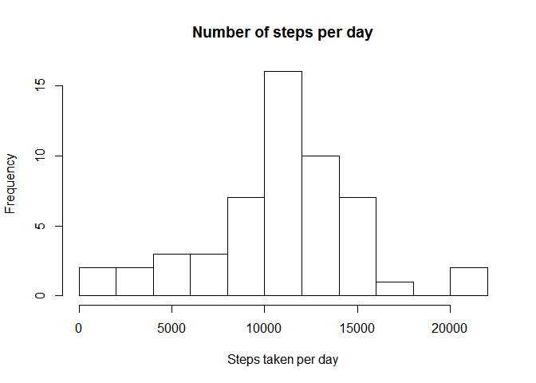
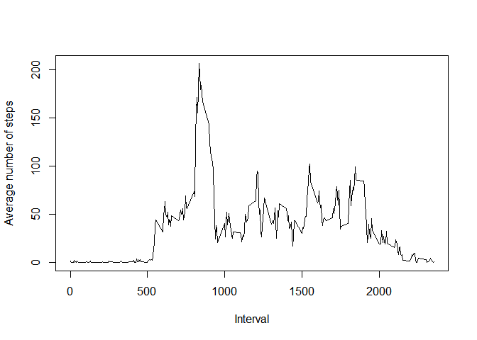
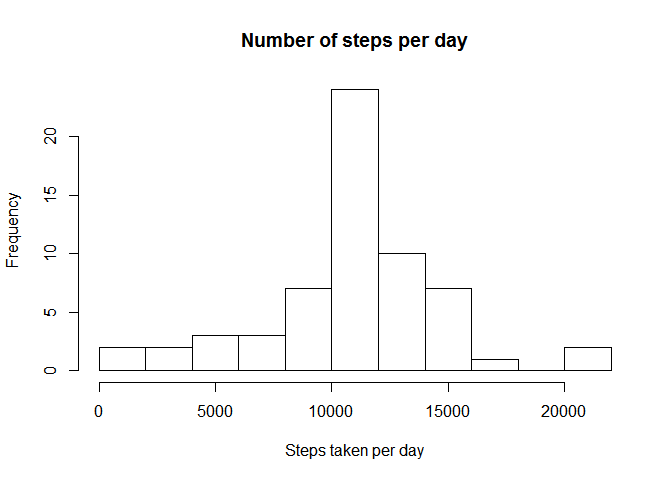
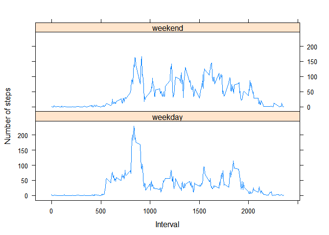

# Reproducible Research: Peer Assessment 1


## Loading and preprocessing the data

At first the data is unziped and loaded


```r
data <- read.csv(unzip("activity.zip"))
```


## What is mean total number of steps taken per day?

Calculate the steps taken per day


```r
stepsPerDay <- aggregate(steps ~ date, data, sum)
```

Histogram of steps taken per day


```r
hist(stepsPerDay$steps, xlab="Steps taken per day", 
     main="Number of steps per day", breaks=10)
```

 

Mean number of steps taken per day


```r
mean(stepsPerDay$steps)
```

```
## [1] 10766
```

Median number of steps taken per day


```r
median(stepsPerDay$steps)
```

```
## [1] 10765
```


## What is the average daily activity pattern?

Calculate the average steps taken per interval over all days


```r
meanStepsPerInterval <- aggregate(steps ~ interval, data, mean)
```

XY-Plot of the 5-minute interval (x-axis) and the average number of steps taken, averaged across all days (y-axis)


```r
plot(meanStepsPerInterval, xlab = "Interval", 
     ylab="Average number of steps", 
     type = "l")
```

 

5-minute interval containing the maximum average number of steps


```r
#get the index of the maximum average number of steps
maxIndex <- which.max(meanStepsPerInterval[,2])

#return the Interval and average step number
meanStepsPerInterval[maxIndex,]
```

```
##     interval steps
## 104      835 206.2
```


## Imputing missing values

Total number of rows with missing values in the dataset


```r
sum(!complete.cases(data))
```

```
## [1] 2304
```

Replace missing values with the rounded average of the interval and store it into a new dataset


```r
#create a copy of the original data
filledData <- data

for (i in 1:nrow(data)){
        #cheack if a row contains "NA" as steps value
        if (is.na(data[i,]$steps)){
                #get the interval of the row
                meanInterval <- data[i,]$interval
                #get the previously calculated corresponding mean value
                meanSteps <- meanStepsPerInterval[meanStepsPerInterval$interval==meanInterval,]$steps
                #overwrite the "NA" with the corresponding rounded mean value
                filledData[i,]$steps <- round(meanSteps, digits = 0)
        }
}
```

Calculate the steps taken per day of the filled dataset


```r
stepsPerDayFilled <- aggregate(steps ~ date, filledData, sum)
```

Histogram of steps taken per day of the filled dataset


```r
hist(stepsPerDayFilled$steps, xlab="Steps taken per day", 
     main="Number of steps per day", breaks=10)
```

 

The mean number of steps taken per day of the filled dataset is the same as in the original dataset.


```r
mean(stepsPerDayFilled$steps)
```

```
## [1] 10766
```

The median number of steps taken per day of the filled dataset is slightly lower (3 steps less) than in the original dataset.


```r
median(stepsPerDayFilled$steps)
```

```
## [1] 10762
```


Total daily number of steps before filling

```r
sum(stepsPerDay$steps)
```

```
## [1] 570608
```

Total daily number of steps after filling

```r
sum(stepsPerDayFilled$steps)
```

```
## [1] 656704
```

The total daily number of steps increased by 86096 steps.

## Are there differences in activity patterns between weekdays and weekends?

A new factor variable with the two levels - "weekday" and "weekend" is created and included in the filled data set.


```r
#calculate the corresponding days
days <- weekdays(as.Date(data$date))
#classify in "weekday" or "weekend" and convert it to factors
dayFactors <- as.factor(ifelse(days %in% c("Saturday","Sunday"), 
                            "weekend", "weekday"))
#include day factors in the filled data frame
filledData <- cbind(filledData, dayFactors)
```

Calculate the average steps taken per interval of the filled dataset for weekdays and weekend days


```r
meanStepsPerIntervalDayFactorWise <- aggregate(steps ~ interval + 
                                                       dayFactors,
                                               filledData, mean)
```

Panel plot containing a time series plot of the 5-minute interval (x-axis) and the average number of steps taken averaged across all weekday days or weekend days (y-axis).


```r
library("lattice")
xyplot(steps~interval | dayFactors, data = meanStepsPerIntervalDayFactorWise, ylab = "Number of steps", xlab="Interval", type = "l", layout = c(1, 2))
```

 
